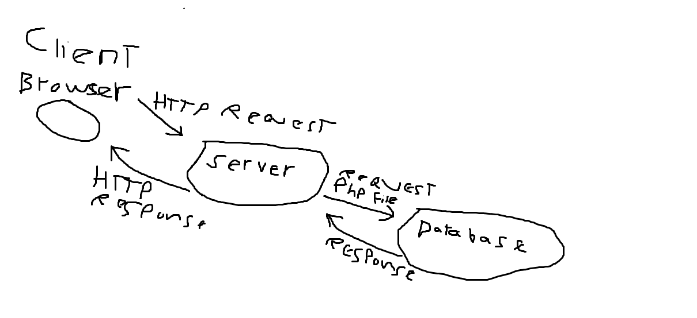
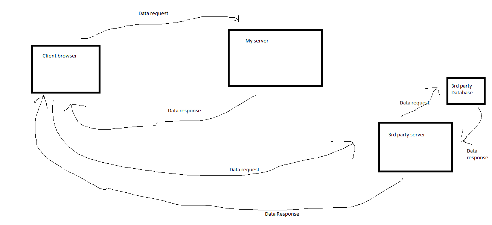
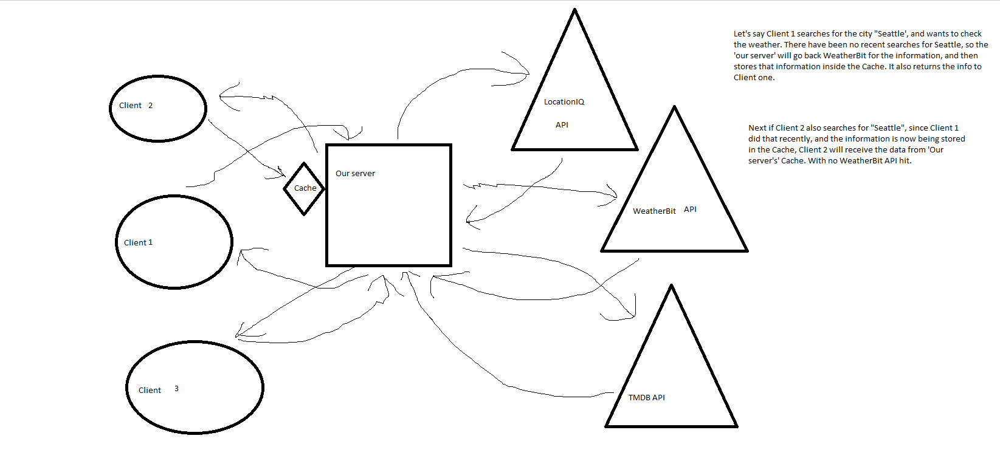

**Author** Kirk Garrison
**Version**: 0.1.0

## Overview
Request/Reponse cycle

API Request/Response cycle

API Request/Response cycle with Weather and Movie API's

API request cycle with Cache

For this website we wanted to make an app that would allow the user to search for any city, and be able to see it's lattitude and longitude, as well as details such as the county, state, and zip code.
After that we wanted to also add the ability to view the weather in that city, as well as see a display of movies that were filmed in that city.
We accomplished this by building a server, and connecting API's to it, to grant the user access to that information. We also built in a cache, to reduce API hits, and increase response speed.

## Getting Started
To build something like this you would need familiarty with the languages required (JS, Cors, Axios, Express). You would want to start by building out a basic front and back end, and ensuring the two are communicating with each other. From there it is a matter of getting your server to retrieve the desired data from the API, and scoping the returns to what you would like displayed back on the rendered page.

## Architecture
For this we used Javascript, Express, Dotenv, Cors, Axios, and React.

## Change Log

11-02-2021 6:00pm - Application has Static map and Lat/Lon values returned upon city search.

11-03-2021 7:00pm - Implemented dummy data from weather.json and got website responsive to that data

11-04-2021 8:00pm - Application now has live data from a Weather API (WeatherBit) and data on movies from (TMDB). It renders those results upon request about the city searched.

11-05-2021 3:00pm - Application has been refactored and now has the Weather rendering inside of it's own folder, as well as the Movie data rendering inside it's own folder. This improves readability and helps keep components to a single function.

11-06-2021 4:25pm - Application now has a working cache, this reduces API hits for duplicate searches on the same city, and improves user information response speed.

## Credit and Collaborations
- Steve Ngo - collaborator for Request/Response cycle (Lab 6)
- Scott Lease - collaborator for API Request/Response cycle (Lab 7)
- Raajvardhan Chaukulkar - collaborator for Weather and movie API additions (Lab 8)
- Brandon Wolf - collaborator for refactoring code into nested components (Lab 10)

- LocationIQ for use to city info
- WeatherBit for use of Forecast data
- TMDB for use of Movie data

### Name of feature: City-Explorer Lab 6

Estimate of time needed to complete: 3 Hours

Start time: 2:30pm

Finish time: 6:00pm

Actual time needed to complete: 3.5 Hours

### Name of feature: City-Explorer Lab 7

Estimate of time needed to complete: 4 Hours

Start time: 1:30pm

Finish time: 7:00pm

Actual time needed to complete: 5.5 Hours

### Name of feature: City-Explorer Lab 8

Estimate of time needed to complete: 5 Hours

Start time: 1:00pm

Finish time: 8:00pm

Actual time needed to complete: 7 Hours

### Name of feature: City-Explorer Lab 9

Estimate of time needed to complete: 2 Hours

Start time: 1:30pm

Finish time: 3:00pm

Actual time needed to complete: 1.5 Hours

### Name of feature: City-Explorer Lab 10

Estimate of time needed to complete: 3 Hours

Start time: 12:30pm

Finish time: 4:25pm

Actual time needed to complete: 4 Hours